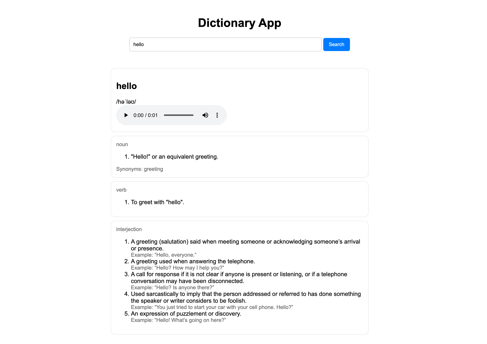

# Dictionary App

This is a simple **Dictionary App** built with **HTML**, **CSS**, and **JavaScript**.  
It uses the free API from [dictionaryapi.dev](https://dictionaryapi.dev/) to show word meanings, examples, and synonyms.

## 📸 Screenshot


## Features
- Type a word and press **Enter** or click **Search** to find meanings.
- Shows word **phonetics** and **audio pronunciation** (if available).
- Displays **examples** and **synonyms**.
- Automatically loads the word **"hello"** when the page opens.

## Technologies Used
- HTML  
- CSS  
- JavaScript  
- Free Dictionary API

## How to Use
1. Open `index.html` in your browser.
2. Type any English word in the input box.
3. Press **Enter** or click **Search**.
4. You will see meanings, examples, and synonyms.

## Project Structure
```
dictionary-app/
│
├── index.html
├── style.css
└── script.js
```

## Example
Try searching for:
```
hello
computer
beautiful
```